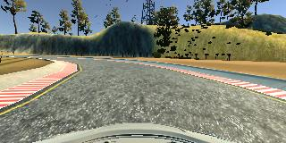
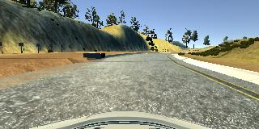
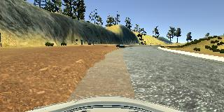
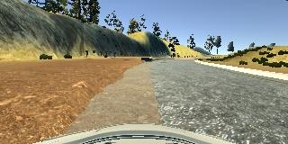
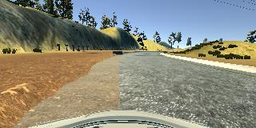

# **Behavioral Cloning** 

## Writeup Template

### You can use this file as a template for your writeup if you want to submit it as a markdown file, but feel free to use some other method and submit a pdf if you prefer.

---

**Behavioral Cloning Project**

The goals / steps of this project are the following:
* Use the simulator to collect data of good driving behavior
* Build, a convolution neural network in Keras that predicts steering angles from images
* Train and validate the model with a training and validation set
* Test that the model successfully drives around track one without leaving the road
* Summarize the results with a written report


[//]: # (Image References)

[image1]: ./examples/placeholder.png "Model Visualization"
[image2]: ./examples/placeholder.png "Grayscaling"
[image3]: ./examples/placeholder_small.png "Recovery Image"
[image4]: ./examples/placeholder_small.png "Recovery Image"
[image5]: ./examples/placeholder_small.png "Recovery Image"
[image6]: ./examples/placeholder_small.png "Normal Image"
[image7]: ./examples/placeholder_small.png "Flipped Image"

## Rubric Points
### Here I will consider the [rubric points](https://review.udacity.com/#!/rubrics/432/view) individually and describe how I addressed each point in my implementation.  

---
### Files Submitted & Code Quality

#### 1. Submission includes all required files and can be used to run the simulator in autonomous mode

My project includes the following files:
* model.py containing the script to create and train the model
* drive.py for driving the car in autonomous mode
* model.h5 containing a trained convolution neural network 
* writeup_report.md or writeup_report.pdf summarizing the results

#### 2. Submission includes functional code
Using the Udacity provided simulator and my drive.py file, the car can be driven autonomously around the track by executing 
```sh
python drive.py model.h5
```

#### 3. Submission code is usable and readable

The model.py file contains the code for training and saving the convolution neural network. The file shows the pipeline I used for training and validating the model, and it contains comments to explain how the code works.

### Model Architecture and Training Strategy

#### 1. An appropriate model architecture has been employed

My model consists of a convolution neural network with 3x3 and 5x5 filter sizes and depths between 24 and 100 (model.py lines 64-81). I have used the model similar to NVIDIA net described in the tutorial.  

The model includes RELU layers to introduce nonlinearity (code line 67,69,71,73 and 75), and the data is normalized in the model using a Keras lambda layer (code line 65). 

#### 2. Attempts to reduce overfitting in the model

The model contains dropout layers, with 50% dropout, in order to reduce overfitting (model.py lines 68, 70, 72, 74 and 76). 

The model was trained and validated on different data sets to ensure that the model was not overfitting. The model was tested by running it through the simulator and ensuring that the vehicle could stay on the track.

#### 3. Model parameter tuning

The model used an adam optimizer, so the learning rate was not tuned manually (model.py line 83).

#### 4. Appropriate training data

Training data was chosen to keep the vehicle driving on the road. I used a combination of center lane driving, recovering from the left and right sides of the road.

For details about how I created the training data, see the next section. 

### Model Architecture and Training Strategy

#### 1. Solution Design Approach

The overall strategy for deriving a model architecture was to ...

My first step was to use a convolution neural network model similar to the Nvidia net. I thought this model might be appropriate because I know that the model is capable for regression proiblem and I know it has used and demostrated succesfully the behaviour cloning using the same approach what we are trying in this project. 

In order to gauge how well the model was working, I split my image and steering angle data into a training and validation set. I found that my first model had a low mean squared error on the training set but a high mean squared error on the validation set. This implied that the model was overfitting. 

To combat the overfitting, I modified the model so that it does not overfit. For this I have added Dropout layers after each Convolution Layer with 50% dropout. 

Then I retrained with same dataset but didnt work well. Then I increase the data with different combinations as suggested in the tutorial and trained again. 

The final step was to run the simulator to see how well the car was driving around track one. And the vehicle is finally able to drive autonomously around the track without leaving the road.

#### 2. Final Model Architecture

The final model architecture (model.py lines 64-81) consisted of a convolution neural network with the following layers and layer sizes.

| Layer      | Shape               |
|------------|---------------------|
| Lambda     | (None, 160, 320, 3) |
| Cropping2D | (None, 65, 320, 3)  |
| Conv2D     | (None, 31, 158, 24) |
| Dropout    | (None, 31, 158, 24) |
| Conv2D     | (None, 14, 77, 36)  |
| Dropout    | (None, 14, 77, 36)  |
| Conv2D     | (None, 5, 37, 48)   |
| Dropout    | (None, 5, 37, 48)   |
| Conv2D     | (None, 3, 35, 64)   |
| Dropout    | (None, 3, 35, 64)   |
| Conv2D     | (None, 1, 33, 64)   |
| Dropout    | (None, 1, 33, 64)   |
| Flatten    | (None, 2112)        |
| Dense      | (None, 100)         |
| Dense      | (None, 50)          |
| Dense      | (None, 10)          |
| Dense      | (None, 1)           |


#### 3. Creation of the Training Set & Training Process

To capture good driving behavior, I recorded two laps of data by running vehicle through the center. On data is driving in actual direction and another in reverse direction.




I then recorded the vehicle recovering from the left side and right sides of the road back to center so that the vehicle would learn to recover from the edges of track .Following images show what a recovery looks like.





To augment the data sat, I also flipped images and angles thinking that this would help to generate more data for better learning. For better perfomance I have added correction to steering angle for left and right camera images by 0.2 and -0.2.

After the collection process, I had 12282 number of data points. I then preprocessed this data by cropping image as specified in tutorial so that only road part is visible.

I finally randomly shuffled the data set and put 20% of the data into a validation set. 

I used this training data for training the model. The validation set helped determine if the model was over or under fitting. The ideal number of epochs was 2. I used an adam optimizer so that manually training the learning rate wasn't necessary.
